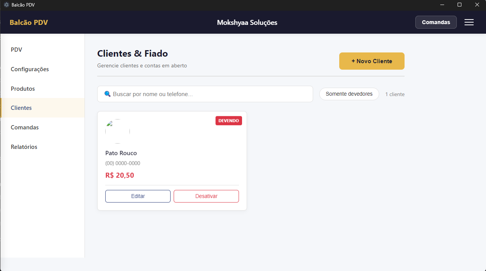
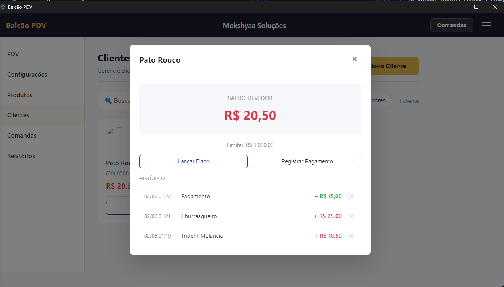

adme · MD
# Balcão PDV
 
Sistema de ponto de venda para comércio de pequeno e médio porte, desenvolvido pela **Mokshyaa Soluções**.
 
Offline-first, personalizável e extensível — feito para funcionar de verdade no dia a dia do comércio de bairro.
 
---
 
## Visão Geral
 
O Balcão PDV nasce da observação de uma realidade comum: o pequeno comerciante que anota vendas no caderno, não controla estoque de forma confiável e depende de sistemas caros ou complexos demais para sua realidade.
 
Este sistema resolve isso com uma solução simples, acessível e que funciona **mesmo sem internet**.
 
---
 
## Screenshots
 
### PDV — Venda Direta

 
### Configurações do Sistema

 
### Personalização de Cores

 
### Módulo de Produtos

### Módulo de Clientes & Fiado

 
---
 
## Funcionalidades
 
- **PDV** — venda direta com leitor de código de barras, carrinho, descontos e cálculo de troco
- **Comandas** — consumo progressivo para atendimento presencial, com painel lateral e registro de horário por item
- **Estoque** — controle de entrada, saída, ajustes e alertas de mínimo
- **Clientes & Fiado** — cadastro de clientes, débito por produto ou avulso, pagamento parcial e extrato com histórico
- **Relatórios** — histórico por período e forma de pagamento *(em desenvolvimento)*
- **Fiscal** — emissão de NFC-e via API homologada *(planejado)*
- **Pagamentos** — dinheiro, PIX, débito, crédito, Stone, Cielo, PagSeguro, Sicoob *(integração planejada)*
- **Personalização** — logo, nome e paleta de cores por estabelecimento
- **Offline-first** — funciona sem internet, sincroniza quando a conexão volta
---
 
## Status do Projeto
 
| Sprint | Descrição | Status |
|--------|-----------|--------|
| 1 | Fundação — Electron, SQLite, Configurações | ✅ Concluído |
| 2 | Produtos e Estoque | ✅ Concluído |
| 3 | PDV — Venda Direta | ✅ Concluído |
| 4 | Comandas | ✅ Concluído |
| 6 | Clientes e Fiado | ✅ Concluído |
| 5 | Fiscal e Pagamentos Avançados | ⏳ Aguardando (depende de CNPJ/certificado) |
| 7 | Relatórios | 🔜 Próximo |
| 8 | Sincronização e Licenciamento | ⏳ Aguardando |
| 9 | Polish e Empacotamento | ⏳ Aguardando |
 
---
 
## Stack
 
| Camada | Tecnologia |
|--------|-----------|
| Desktop | Electron |
| Interface | HTML5 / CSS3 / JavaScript ES6+ |
| Banco local | SQLite via better-sqlite3 |
| Sincronização | Supabase (Sprint 8) |
| Fiscal | Focus NFe API (Sprint 5) |
| Empacotamento | Electron Builder |
 
---
 
## Estrutura do Projeto
 
\`\`\`
balcao-pdv/
├── main.js                          # Inicialização do Electron
├── preload.js                       # Ponte segura interface ↔ sistema
├── package.json
├── src/
│   ├── database/
│   │   ├── db.js                    # Conexão SQLite
│   │   └── migrations/
│   │       ├── 001-setup-inicial.sql
│   │       ├── 002-criar-tabela-produtos.sql
│   │       ├── 003-criar-tabelas-vendas.sql
│   │       ├── 004-criar-tabelas-comandas.sql
│   │       └── 005-criar-tabelas-fiado.sql
│   ├── modules/
│   │   ├── configuracoes/
│   │   ├── produtos/
│   │   ├── vendas/
│   │   ├── comandas/
│   │   └── fiado/
│   └── ui/
│       ├── index.html
│       ├── css/
│       └── js/
└── docs/
    └── screenshots/
\`\`\`
 
---
 
## Como Rodar Localmente
 
**Pré-requisitos:** Node.js instalado.
 
\`\`\`bash
# Clone o repositório
git clone https://github.com/NandaRomao/balcao-pdv.git
 
# Entre na pasta
cd balcao-pdv
 
# Instale as dependências
npm install
 
# Se necessário, recompilar o SQLite para o Electron
npm run rebuild
 
# Rode o sistema
npm start
\`\`\`
 
---
 
## Princípios do Projeto
 
**Separação de responsabilidades** — cada arquivo faz uma coisa. A interface nunca acessa o banco diretamente; toda lógica de dados fica nos handlers.
 
**Offline-first** — todas as operações principais funcionam sem internet.
 
**Transações atômicas** — operações que envolvem múltiplas tabelas (fechar venda, fechar comanda, lançar fiado de produto) usam transações para garantir consistência: ou tudo acontece, ou nada acontece.
 
**Saldo calculado, não armazenado** — o saldo devedor do fiado é sempre recalculado a partir dos lançamentos, garantindo que extrato e saldo nunca fiquem dessincronizados.
 
**Extensível** — arquitetura modular permite adicionar novos módulos sem quebrar o que já existe.
 
**Acessível** — interface pensada para quem não tem familiaridade com tecnologia.
 
---
 
## Sobre
 
Desenvolvido por **Fernanda Romão**
 

 
---
 
*Balcão PDV — Mokshyaa Soluções*