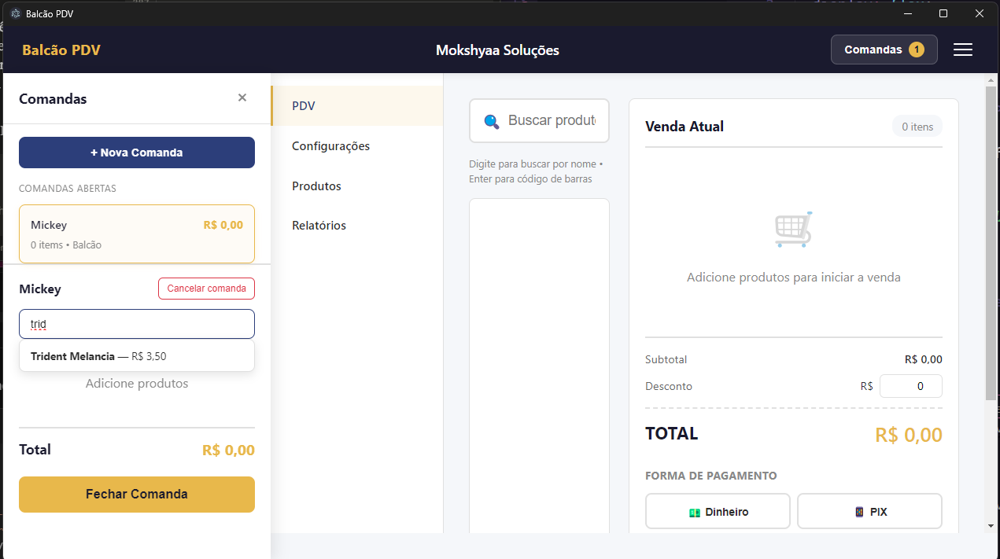
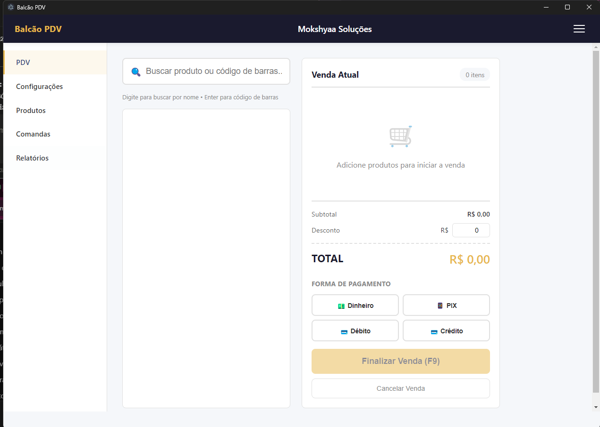
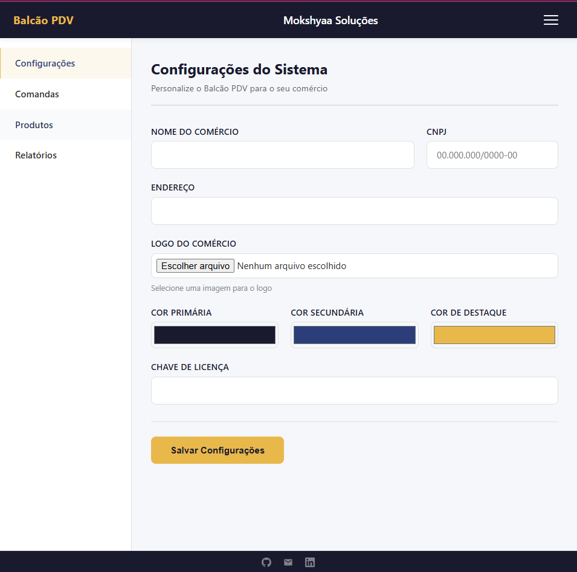
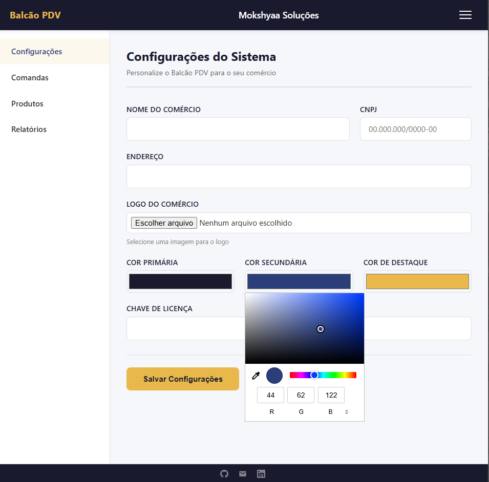
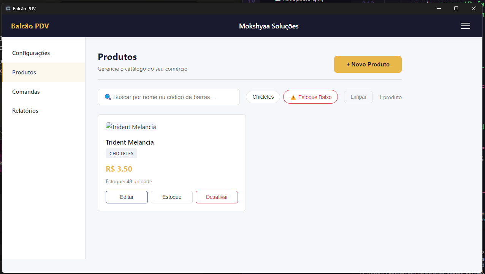

# Balcão PDV

Sistema de ponto de venda para comércio de pequeno e médio porte, desenvolvido pela **Mokshyaa Soluções**.

Offline-first, personalizável e extensível — feito para funcionar de verdade no dia a dia do comércio de bairro.

---

## Visão Geral

O Balcão PDV nasce da observação de uma realidade comum: o pequeno comerciante que anota vendas no caderno, não controla estoque de forma confiável e depende de sistemas caros ou complexos demais para sua realidade.

Este sistema resolve isso com uma solução simples, acessível e que funciona **mesmo sem internet**.

---

## Screenshots

### PDV — Comandas

### PDV — Venda Direta

### Configurações do Sistema

### Personalização de Cores

### Módulo de Produtos

---

## Funcionalidades Previstas

- **PDV** — venda direta com leitor de código de barras
- **Comandas** — consumo progressivo para atendimento presencial
- **Estoque** — controle de entrada, saída e alertas de mínimo
- **Fiado** — controle de clientes com histórico por data e item
- **Relatórios** — histórico por período e forma de pagamento
- **Fiscal** — emissão de NFC-e via API homologada
- **Pagamentos** — dinheiro, PIX, débito, crédito, Stone, Cielo, PagSeguro, Sicoob
- **Personalização** — logo, nome e paleta de cores por estabelecimento
- **Offline-first** — funciona sem internet, sincroniza quando a conexão volta

---

## Status do Projeto

| Sprint | Descrição | Status |
|--------|-----------|--------|
| 1 | Fundação — Electron, SQLite, Configurações | ✅ Concluído |
| 2 | Produtos e Estoque | ✅ Concluído |
| 3 | PDV — Venda Direta | ✅ Concluído |
| 4 | Comandas | ✅ Concluído |
| 5 | Fiscal e Pagamentos Avançados | 🔜 Próximo |
| 6 | Fiado e Clientes | ⏳ Aguardando |
| 7 | Relatórios | ⏳ Aguardando |
| 8 | Sincronização e Licenciamento | ⏳ Aguardando |
| 9 | Polish e Empacotamento | ⏳ Aguardando |

---

## Stack

| Camada | Tecnologia |
|--------|-----------|
| Desktop | Electron |
| Interface | HTML5 / CSS3 / JavaScript ES6+ |
| Banco local | SQLite via better-sqlite3 |
| Sincronização | Supabase (Sprint 8) |
| Fiscal | Focus NFe API (Sprint 5) |
| Empacotamento | Electron Builder |

---

## Estrutura do Projeto